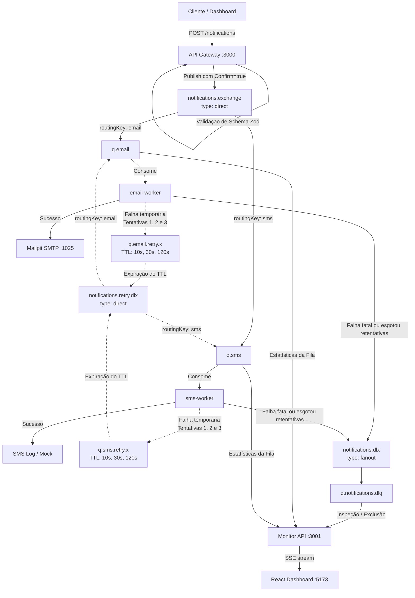

# ✉️ Notification Delivery System — Monorrepósitório com RabbitMQ & Docker

Este repositório consiste em um sistema distribuído de notificações desenvolvido como um projeto de estudos práticos e avançados sobre arquitetura orientada a eventos e mensageria robusta utilizando o **RabbitMQ**.

O sistema está estruturado em formato de **Monorepo** com microsserviços empacotados em containers Docker. A aplicação permite enviar notificações nos canais de **E-mail** (integrado ao Mailpit com envio real) e **SMS** (simulado via mock logs).

---

## 🏗️ Arquitetura do Sistema e Fluxo de Mensagens

O fluxo geral consiste em uma API de entrada (Gateway) que recebe as solicitações, valida as regras de negócio de maneira síncrona e enfileira no RabbitMQ para processamento assíncrono pelos workers dedicados. Abaixo está o pipeline completo detalhando a resiliência (Retentativas e Fila de Mensagens Mortas/DLQ):



---

## 🛡️ Resiliência e Mensageria no RabbitMQ

A topologia do RabbitMQ foi projetada seguindo padrões corporativos de resiliência e prevenção contra perda de dados:

1. **Mensagens e Filas Duráveis (`durable: true`)**:
   - Todas as exchanges, filas principais e filas de retry são declaradas como duráveis.
   - As mensagens são publicadas com a propriedade `durable: true` (modo de entrega persistente), fazendo com que persistam em disco e sobrevivam a eventuais reinicializações do broker.

2. **Publisher Confirms (`confirm: true`)**:
   - O `api-gateway` só responde `202 Accepted` ao cliente após receber a confirmação de recebimento (ACK) emitida pelo RabbitMQ. Isso garante que a mensagem de fato entrou na fila e não foi descartada na rede.

3. **Estratégia de Retry Baseada em TTL (Delay Queues)**:
   - Quando um processamento de worker falha devido a erros transitórios (ex: falhas de rede ou queda de integradores), o sistema não faz o re-enfileiramento na própria fila de trabalho imediatamente para evitar o efeito *Head-of-Line Blocking* (um item defeituoso bloqueando os demais).
   - O worker publica a mensagem em uma fila temporária de retry (`q.email.retry.0`, `1`, `2`...) configurada com um tempo de vida (TTL) progressivo:
     - **Tentativa 1**: Atraso de **10 segundos**
     - **Tentativa 2**: Atraso de **30 segundos**
     - **Tentativa 3**: Atraso de **120 segundos (2 minutos)**
   - Ao expirar o TTL nessas filas de retry, as mensagens são automaticamente redirecionadas (via `x-dead-letter-exchange`) de volta para a fila principal (`q.email` ou `q.sms`) para serem processadas novamente.

4. **Dead Letter Queue (DLQ) para Erros Fatais**:
   - Mensagens que falham permanentemente após 3 tentativas ou que possuem erros de esquema irreparáveis (ex: tipo de dados inválido que passou na validação inicial) são descartadas com `requeue: false`.
   - Graças à configuração do argumento `x-dead-letter-exchange: notifications.dlx` na fila principal, o RabbitMQ redireciona a mensagem descartada para a exchange da DLQ, caindo na fila `q.notifications.dlq`.
   - As mensagens ficam salvas lá para auditoria manual e depuração, podendo ser inspecionadas e limpas no dashboard.

---

## 📡 Monitoramento em Tempo Real com SSE (Server-Sent Events)

A API de monitoramento (`monitor-api`) expõe um endpoint (`/queues/stream`) que utiliza a tecnologia **SSE (Server-Sent Events)** para empurrar as estatísticas de volumetria de filas e DLQ em tempo real para o dashboard.

A escolha de SSE em detrimento de uma solução como **WebSockets** foi tomada de forma consciente, considerando os seguintes trade-offs arquiteturais:

* **Unidirecionalidade Adequada**: O fluxo de dados de monitoramento é exclusivamente do servidor para o cliente (*Server-to-Client*). O dashboard apenas renderiza os dados recebidos e não precisa responder através do mesmo canal. WebSockets fornece comunicação bidirecional completa, o que seria desnecessário (*overkill*) para este cenário.
* **Simplicidade de Protocolo (HTTP Tradicional)**: O SSE opera sob o protocolo HTTP padrão, utilizando a conexão persistente com o cabeçalho `Content-Type: text/event-stream`. Isso significa que ele passa nativamente por proxies reversos, firewalls e balanceadores de carga sem a necessidade de configurações especiais ou handshakes complexos de atualização de protocolo (como o `Upgrade` requerido pelo WebSocket).
* **Resiliência e Reconexão Nativa**: O cliente no navegador (utilizando a API nativa `EventSource`) lida de forma automática com reconexões caso o servidor caia ou sofra alguma instabilidade temporária. No WebSocket, essa lógica de reconexão precisaria ser desenvolvida manualmente no frontend.
* **Menor Overhead de Implementação**: SSE consome menos recursos de rede e de processamento no servidor para gerenciar as conexões persistentes abertas, mantendo a simplicidade da aplicação Fastify.

---

## 🛠️ Tecnologias Utilizadas

- **Runtime & Linguagem**: Node.js (v24) & TypeScript.
- **Frameworks HTTP (Fastify)**: Utilizado no `api-gateway` e no `monitor-api` por ser leve, performático e compatível com schemas modernos.
- **Validação de Schemas**: Zod & `@fastify/type-provider-zod` para validação em tempo de execução dos dados de entrada.
- **Documentação de API**: Swagger + `@scalar/fastify-api-reference` para renderizar interfaces modernas de documentação no endpoint `/docs`.
- **Frontend**: React, Vite, Tailwind CSS / Vanilla CSS e ícones do Lucide.
- **Mensageria**: RabbitMQ 4.3 (Alpine) com o plugin Management ativado.
- **Integração de E-mail**: Nodemailer para comunicação SMTP + **Mailpit** atuando como servidor de e-mail mock de alta fidelidade para testes em ambiente local.
- **Containers**: Docker e Docker Compose, utilizando recursos de Multi-stage builds e desenvolvimento assistido por `docker compose watch`.

---

## 📁 Estrutura do Monorepo

O monorepo utiliza o gerenciador de pacotes **pnpm** estruturado da seguinte forma:

```bash
demo-rabbitmq/
├── apps/
│   ├── api-gateway/       # API Fastify executando na porta 3000 (Recebe notificações)
│   ├── monitor-api/       # API Fastify executando na porta 3001 (Consome estatísticas do RabbitMQ e gerencia DLQ)
│   ├── dashboard/         # Single Page Application React servida via Nginx na porta 5173
│   ├── email-worker/      # Worker que escuta a fila q.email e envia e-mails reais via SMTP
│   └── sms-worker/        # Worker que escuta a fila q.sms e simula envio de mensagens de texto
├── rabbitmq/
│   └── definitions.json   # Configuração estática de usuários, vhosts e permissões do RabbitMQ
├── compose.yaml           # Arquivo de orquestração do Docker para Produção
├── compose.override.yaml  # Configuração de desenvolvimento e watch mode do Docker Compose
├── package.json           # Configuração de workspaces e scripts globais do projeto
└── lefthook.yml           # Gerenciamento automatizado de Git Hooks
```

---

## 🚀 Como Executar o Projeto

Você pode rodar todo o ecossistema facilmente com **Docker Compose**. Certifique-se de que possui o Docker instalado em sua máquina.

### Configuração Inicial de Variáveis
Copie as variáveis do arquivo de exemplo para configurar o ambiente do Docker e das APIs:
```bash
cp .env.example .env
```

### Opção A: Executar em Modo de Desenvolvimento (Recomendado)
Para trabalhar ativamente no código e testar alterações em tempo real, execute:
```bash
docker compose watch
```
* **O que acontece por trás?** O Docker inicia todas as aplicações em modo de desenvolvimento (porta `5173` para o dashboard, `3000` para a API, `3001` para o monitor, além do RabbitMQ e Mailpit). A funcionalidade de watch do Docker monitora e sincroniza suas alterações locais na pasta `src/` das APIs diretamente com o container, executando o hot-reload imediatamente.

### Opção B: Executar em Modo de Produção (Imagem Otimizada)
Para emular a aplicação em um ambiente real e estável de produção:
```bash
docker compose -f compose.yaml up --build -d
```
* **O que acontece por trás?** O Docker ignora as configurações de desenvolvimento. Ele realiza builds de múltiplos estágios (*multi-stage building*) gerando imagens extremamente leves e seguras:
  - **Distroless**: O runtime dos microsserviços Node usa imagens base Distroless da Google (`gcr.io/distroless/nodejs24`). Elas não possuem shell, gerenciadores de pacotes ou ferramentas desnecessárias, reduzindo expressivamente a superfície de ataque da aplicação.
  - **Nginx Sem Privilégios (Unprivileged)**: O frontend é exposto em um container Nginx Alpine executado sob um usuário sem privilégios de root, minimizando riscos de brechas de segurança.

### Opção C: Executar Localmente sem Docker (Apenas infra no Docker)
Se quiser rodar os processos Node diretamente em seu sistema operacional local:
1. Inicie apenas o broker e o e-mail mock com o Docker:
   ```bash
   pnpm infra
   ```
2. Instale as dependências locais:
   ```bash
   pnpm install
   ```
3. Execute todas as aplicações de uma vez em modo dev local:
   ```bash
   pnpm dev
   ```

---

## 🔗 Portas e Endpoints Úteis

| Serviço | Endereço / URL | Finalidade |
| :--- | :--- | :--- |
| **Dashboard Frontend** | [http://localhost:5173](http://localhost:5173) | Interface gráfica para enviar notificações e gerenciar filas/DLQ |
| **API Gateway (Swagger/Scalar)** | [http://localhost:3000/docs](http://localhost:3000/docs) | Documentação interativa Scalar das rotas do Gateway de envio |
| **Monitor API (Swagger/Scalar)** | [http://localhost:3001/docs](http://localhost:3001/docs) | Documentação interativa Scalar das rotas de estatísticas e DLQ |
| **RabbitMQ Management** | [http://localhost:15672](http://localhost:15672) | Console nativo de administração (Padrão: `admin` / `admin`) |
| **Mailpit Web UI (Caixa Postal)**| [http://localhost:8025](http://localhost:8025) | Webmail para visualizar as notificações de e-mail enviadas |

---

## 🧪 Como Testar Toda a Aplicação (Passo a Passo)

### 1. Enviar Notificação com Sucesso (Fluxo Feliz)
1. Acesse o **Dashboard** ([http://localhost:5173](http://localhost:5173)).
2. Preencha o formulário selecionando o canal **E-mail**, preenchendo o destinatário (ex: `dev@example.com`), o assunto e a mensagem.
3. Clique em **Enviar Notificação**.
4. O console lateral (Stream de Eventos) exibirá `202 Aceito`.
5. Acesse o **Mailpit** ([http://localhost:8025](http://localhost:8025)) e confira se o e-mail foi recebido com o assunto e conteúdo corretos.

### 2. Testar o Pipeline de Retries (Falha Temporária)
O Worker de SMS possui um gatilho de simulação configurado no código. Ele lança um erro temporário se o corpo da mensagem contiver a palavra `"fail"`.
1. No formulário do Dashboard, escolha o canal **SMS**.
2. No campo do número de telefone, insira um número no formato E.164 (ex: `+5511999999999`).
3. No campo da mensagem, escreva obrigatoriamente a palavra **`fail`** (exemplo: `"Minha notificação fail de teste"`).
4. Clique em **Enviar Notificação**.
5. **Acompanhe o Pipeline**:
   - A mensagem entrará na fila principal `q.sms`.
   - O worker processará e falhará. Ele enviará a mensagem para a fila de atraso `q.sms.retry.0`. Você verá visualmente no dashboard o contador de mensagens subir nessa fila amarela.
   - Após **10 segundos**, a mensagem sai do retry e volta para a fila `q.sms`. Ela falha novamente e entra na fila `q.sms.retry.1` (onde aguardará por **30 segundos**).
   - Ela retorna e falha pela terceira vez, aguardando **120 segundos (2 minutos)** na fila `q.sms.retry.2`.
   - Você pode acompanhar essas passagens de tempo em tempo real pelas métricas de estatísticas ou pelos logs no terminal (`docker compose logs -f sms-worker`).

> [!NOTE]
> **Atraso na Atualização Visual (Limitação Técnica)**: 
> É normal que o dashboard leve até **5 segundos** para atualizar os números de mensagens nas filas. Isso é uma limitação da própria API nativa de gerenciamento do RabbitMQ, que coleta e disponibiliza estatísticas e métricas de tráfego do broker em intervalos definidos de 5 segundos.

### 3. Testar a Dead Letter Queue (DLQ)
Depois de passar pelas 3 retentativas na fila de SMS descritas acima, a mensagem excederá a quantidade máxima de tentativas. O worker desistirá dela, fazendo com que o RabbitMQ a transfira automaticamente para a fila morta (`q.notifications.dlq`).
1. Ao final dos 2 minutos da última retentativa, verifique a seção **Dead Letter Queue (DLQ)** no rodapé do dashboard.
2. A mensagem inválida aparecerá na lista da DLQ detalhando o motivo do erro.
3. Você poderá realizar uma auditoria do payload que falhou ou simplesmente limpar a DLQ clicando no botão **Limpar Fila Morta (Purge)**.

---

## 🛠️ Ferramental de Desenvolvimento e Git Hooks

Para garantir um padrão profissional de código no monorepo, o repositório conta com validação automática antes da persistência de commits e pushs de código.

### Como funciona o prepare script?
No arquivo `package.json` raiz, você encontrará o script `"prepare": "lefthook install"`. 
- **O ciclo de vida prepare**: O script de ciclo de vida `prepare` é disparado automaticamente pelo gerenciador de pacotes logo após a execução de um `pnpm install` ou `npm install` local.
- **Por que é executado na instalação?** Ele garante que as configurações locais de hooks do Git sejam injetadas de forma automática na pasta `.git/hooks/` do desenvolvedor assim que ele clona e instala o projeto. Isso remove a dependência de processos de onboarding manuais, blindando o repositório contra commits que quebrem os padrões estabelecidos.

### Lefthook
O [Lefthook](https://github.com/evilmartians/lefthook) é um gerenciador de hooks git moderno, rápido e escrito em Go. Ele gerencia as seguintes ações configuradas em `lefthook.yml`:

- **Pre-commit**: 
  Durante o commit de arquivos, ele executa o comando `npx @biomejs/biome check --write` de forma paralela apenas nos arquivos modificados (*staged files*).
  - O **Biome** é uma ferramenta de cadeia rápida para web, responsável por formatar e analisar estaticamente (linter) códigos JS/TS de forma centenas de vezes mais rápida que ESLint e Prettier combinados.
  - Com a flag `--write` e a configuração `stage_fixed: true`, quaisquer correções de formatação ou erros simples de lint são ajustados e salvos de volta no commit de forma automática.

- **Commit-msg**:
  Inicia a ferramenta **Commitlint** para garantir a consistência das mensagens escritas de acordo com a especificação das **Conventional Commits**.
  - O commit sempre deve seguir o padrão: `tipo(escopo): descrição` (exemplo: `feat(api-gateway): add request logging`).
  - Commits com descrições informais como `ajustes` ou `corrigindo erro` serão rejeitados na hora, assegurando que o histórico de commits do Git permaneça limpo e rastreável.
